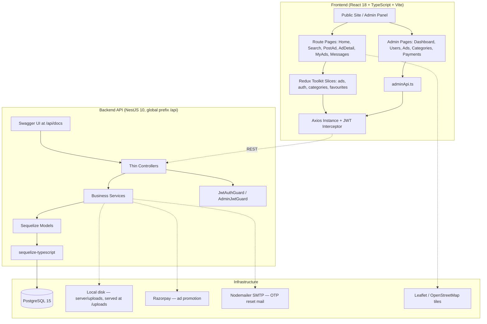

# 🛒 Sellora — Local Marketplace & Classifieds Platform

[](#-project-status)
[](client)
[](server)
[](server/src/database)
[](#-api-reference)

**Sellora** is a buy-and-sell classifieds marketplace for the Indian market — cars, motorcycles, mobiles, electronics, furniture, fashion, real estate, jobs, books & sports, and pets. It ships an end-user listing and discovery flow, buyer–seller messaging, Razorpay-backed ad promotion, and a role-gated admin panel.

> 🚧 This is an actively developed MVP built for the PSSPL AI Acceleration Month evaluation, not a finished product. See [Project Status](#-project-status) for exactly what's built, partial, or pending.

---

## 🏗️ Architecture Overview

Built as a **Controller → Service → Model** layered NestJS API behind a feature-organised React SPA, with Sequelize over PostgreSQL, JWT bearer auth on both the user and admin surfaces, and ad images stored on the API's local disk and served statically.



### Key Design Decisions
- **Feature-module backend** — every domain (`ads`, `auth`, `payments`, `admin`, …) is a self-contained NestJS module with its own controller, service, and DTOs; controllers stay thin and delegate all logic to services.
- **Migrations as the schema source of truth** — `synchronize: false` everywhere. The schema only ever changes through a committed Sequelize migration, never through model auto-sync.
- **`underscored: true` mapping** — models use camelCase in TypeScript and snake_case in Postgres, mapped by Sequelize rather than by hand.
- **Two guards, one token scheme** — `JwtAuthGuard` protects user routes; `AdminJwtGuard` additionally asserts `user.role === 'admin'`, so the admin panel needs no separate auth stack.
- **Images stored as URL arrays, not join rows** — Multer writes up to 5 files per ad to `server/uploads/`, and only the resulting URLs are persisted, as a JSONB array on the ad. Fine for a single-node MVP; object storage is the obvious next step before horizontal scaling.
- **Server-priced promotion plans** — promotion amounts live in a server-side `PLANS` map and Razorpay signatures are verified with an HMAC check before an ad's `featuredUntil` is extended, so the client can never set its own price.

---

## ✨ Key Highlights

- **Post an ad with a real location** — Leaflet map picker captures `lat`/`lng` alongside city/state, so listings are geocoded rather than free-text.
- **Filtered discovery** — keyword, category, city, and price-range search with pagination over the ads index.
- **Buyer–seller messaging** — per-ad message threads between a buyer and a seller, listed as conversations.
- **OTP password reset** — 6-digit, time-expiring OTP emailed via Nodemailer, stored against the user with an expiry timestamp.
- **Featured ads via Razorpay** — 7-day and 30-day boost plans, order creation plus signature verification, with `featuredUntil` driving homepage placement.
- **Admin panel** — KPI dashboard, user ban / promote-to-admin, ad status moderation and takedown, category tree CRUD, and a payments ledger.
- **Swagger-documented API** — every endpoint browsable with bearer auth at `/api/docs`.

---

## 🛠️ Technology Stack

| Layer | Technologies Used |
| :--- | :--- |
| **Frontend** | React 18, TypeScript, Vite 5, Tailwind CSS 3, React Router v6, Redux Toolkit + React Redux, react-hook-form, react-hot-toast, lucide-react |
| **Backend** | NestJS 10, TypeScript, class-validator + class-transformer, Swagger / OpenAPI |
| **Database** | PostgreSQL 15 |
| **ORM** | Sequelize 6 + sequelize-typescript, Sequelize CLI for migrations & seeders |
| **Authentication** | JWT via `@nestjs/jwt` + `@nestjs/passport` (passport-jwt), BCrypt password hashing |
| **File Storage** | Multer disk storage — `server/uploads/`, served statically at `/uploads` |
| **Maps** | Leaflet.js + react-leaflet (location picking) |
| **Payments** | Razorpay (ad promotion / featured ads) |
| **Email** | Nodemailer (SMTP, OTP password reset) |
| **Tooling** | Husky (git hooks), concurrently, Docker Compose (local Postgres) |

---

## 📁 Repository Directory Structure

```text
sellora/
├── .claude/                  # Claude Code configs and slash commands
├── client/                   # React + TypeScript SPA (Vite, port 5173)
│   └── src/
│       ├── admin/            # Admin panel — adminApi, AdminLayout, 5 admin pages
│       ├── api/              # Base axios config
│       ├── common/           # axiosInstance (JWT interceptor), labels.json
│       ├── components/       # Navbar, Footer, Logo, AdCard, PromoteModal, PrivateRoute
│       ├── pages/            # 12 route pages (Home, Search, PostAd, AdDetail, …)
│       ├── services/         # Per-feature API call wrappers
│       └── store/            # Redux Toolkit store + slices
├── server/                   # NestJS API (port 3000, global prefix /api)
│   ├── src/
│   │   ├── admin/            # Admin controller, service, AdminJwtGuard
│   │   ├── ads/              # Ad CRUD, search, filters, pagination
│   │   ├── auth/             # Register, login, OTP password reset, mail service
│   │   ├── categories/       # Hierarchical category tree
│   │   ├── common/           # JwtAuthGuard, CurrentUser decorator
│   │   ├── database/         # Models, migrations, seeders, Sequelize config
│   │   ├── favourites/       # Save / unsave ads
│   │   ├── messages/         # Buyer–seller messaging
│   │   ├── payments/         # Razorpay orders, verification, promotion plans
│   │   ├── upload/           # Multer disk image upload (max 5 files)
│   │   └── main.ts           # Bootstrap, CORS, ValidationPipe, Swagger
│   └── uploads/              # Uploaded ad images, served at /uploads
├── docker-compose.yml        # Local PostgreSQL 15 container
├── CLAUDE.md                 # Project context for Claude Code
└── package.json              # Root workspace scripts (install:all, dev, build, test)
```

---

## 🚀 Getting Started

### Prerequisites
- [Node.js 20+](https://nodejs.org/) & npm
- [PostgreSQL 15](https://www.postgresql.org/) — or Docker, to use the bundled `docker-compose.yml`
- Razorpay **test-mode** keys (ad promotion) and SMTP credentials (OTP email) — optional for local dev; only those two features degrade without them

Ad images need no third-party account — they're written to `server/uploads/` on disk.

### 1. Clone
```bash
git clone <repository-url>
cd sellora
```

### 2. Install dependencies
```bash
npm run install:all   # root + client + server
```

### 3. Start PostgreSQL
```bash
docker compose up -d   # PostgreSQL 15 on localhost:5432
```
Or point the env vars below at an existing local Postgres instance.

### 4. Configure environment
```bash
cp server/.env.example server/.env   # fill in your own real values
cp client/.env.example client/.env
```
**Only the `.env.example` templates are committed; the filled-in `.env` files are gitignored and must never be pushed.**

### 5. Run migrations and seed categories
```bash
cd server
npm run migration:run   # 9 migrations
npm run seed            # seeds the 10 top-level categories
```

### 6. Start the app
```bash
# From the repo root — frontend + backend concurrently
npm run dev
```
| Service | URL |
|---|---|
| Frontend | http://localhost:5173 |
| API | http://localhost:3000/api |
| Swagger docs | http://localhost:3000/api/docs |

Run them separately if you prefer:
```bash
cd server && npm run start:dev   # backend only
cd client && npm run dev         # frontend only
```

### Production build
```bash
npm run build   # nest build + tsc && vite build
```

### Environment Variables

`server/.env` — see [server/.env.example](server/.env.example):

| Variable | Purpose |
|---|---|
| `DB_HOST` / `DB_PORT` / `DB_NAME` / `DB_USER` / `DB_PASS` | PostgreSQL connection |
| `JWT_SECRET` | Signing secret for access tokens |
| `RAZORPAY_KEY_ID` / `RAZORPAY_KEY_SECRET` | Ad promotion payments |
| `SMTP_HOST` / `SMTP_PORT` / `SMTP_USER` / `SMTP_PASS` / `SMTP_FROM` | Nodemailer OTP reset email |
| `PORT` | API port (default `3000`) |

`client/.env` — see [client/.env.example](client/.env.example):

| Variable | Purpose |
|---|---|
| `VITE_API_URL` | Backend base URL (default `http://localhost:3000`) |
| `VITE_FRONTEND_URL` | Public frontend URL, used in emailed links |

> CORS is currently pinned to `http://localhost:5173` in [server/src/main.ts](server/src/main.ts) — change it there when deploying.

---

## 🔌 API Reference

All routes are prefixed with `/api`. Full contracts, request bodies, and response shapes are browsable in Swagger at `/api/docs`.

| Module | Endpoints |
|---|---|
| **auth** | `POST /auth/register`, `POST /auth/login`, `POST /auth/forgot-password`, `POST /auth/reset-password` |
| **users** | `GET /users/me`, `PATCH /users/me` |
| **ads** | `GET /ads`, `GET /ads/my`, `GET /ads/:id`, `POST /ads`, `PATCH /ads/:id`, `DELETE /ads/:id` |
| **categories** | `GET /categories`, `GET /categories/:slug` |
| **favourites** | `GET /favourites`, `POST /favourites/:adId/toggle` |
| **messages** | `POST /messages`, `GET /messages`, `GET /messages/thread` |
| **payments** | `GET /payments/plans`, `POST /payments/create-order`, `POST /payments/verify` |
| **upload** | `POST /upload/images` (max 5 files) |
| **admin** 🔒 | `GET /admin/stats`, `GET /admin/users`, `PATCH /admin/users/:id/ban`, `PATCH /admin/users/:id/make-admin`, `GET /admin/ads`, `PATCH /admin/ads/:id/status`, `DELETE /admin/ads/:id`, `GET /admin/categories`, `POST /admin/categories`, `PATCH /admin/categories/:id`, `DELETE /admin/categories/:id`, `GET /admin/payments` |

🔒 = requires `AdminJwtGuard` (`role === 'admin'`). Promote your first admin directly in the database, then use `PATCH /admin/users/:id/make-admin` for the rest.

---

## 🗄️ Database Models

| Model | Fields |
|---|---|
| **User** | `id`, `name`, `email` (unique), `phone`, `passwordHash`, `city`, `avatar`, `role`, `resetOtp`, `resetOtpExpiry`, `createdAt` |
| **Category** | `id`, `name`, `slug`, `icon`, `parentId` — self-referential tree with `parent` / `subcategories` |
| **Ad** | `id`, `title`, `description`, `price`, `images` (JSONB), `categoryId`, `userId`, `city`, `state`, `lat`, `lng`, `status` (enum), `views`, `featuredUntil`, `createdAt` |
| **Favourite** | `userId`, `adId` |
| **Message** | `id`, `senderId`, `receiverId`, `adId`, `body`, `createdAt` |
| **Payment** | `id`, `userId`, `adId`, `razorpayOrderId`, `razorpayPaymentId`, `amount`, `plan`, `status` |

### Migrations (applied in order)
```text
20260428000001-create-users            20260428000006-add-reset-otp-to-users
20260428000002-create-categories       20260428000007-add-featured-to-ads
20260428000003-create-ads              20260428000008-create-payments
20260428000004-create-favourites       20260428000009-add-role-to-users
20260428000005-create-messages
```

```bash
cd server
npm run migration:generate -- <name>   # scaffold a new migration
npm run migration:run                  # apply
npm run migration:revert               # undo the last one
npm run seed                           # run seeders
```

### Seed Data
[server/src/database/seeders](server/src/database/seeders) creates the 10 top-level categories: Cars, Motorcycles, Mobile Phones, Electronics, Furniture, Fashion, Real Estate, Jobs, Books & Sports, Pets. **No user accounts or credentials are seeded or published in this repo** — register through the app for local test users.

---

## 🧪 Testing

```bash
npm test          # from the repo root → jest in server/
```
Jest and ts-jest are configured on the backend, but **no test suites have been written yet** — the command currently passes with zero tests. Frontend testing (Vitest + React Testing Library) is not wired up. Type safety is the practical gate today:
```bash
cd client && npx tsc --noEmit   # must pass before committing
```

---

## 🔄 Development Workflow

```bash
git checkout master && git pull
git checkout -b feat/<scope>
# work, commit (conventional commits), push
# open a PR into master
```

Husky git hooks live in [.husky/](.husky/). Commit convention:
```text
feat: add category filter to search
fix: resolve image upload 500 error
chore: update sequelize migration for messages
```

---

## 📚 Documentation

| Doc | Purpose |
|---|---|
| [CLAUDE.md](CLAUDE.md) | Project context for Claude Code — stack, modules, endpoints, models, commands |
| [prompt-engineering-examples.md](prompt-engineering-examples.md) | Prompt engineering patterns used while building Sellora |
| Swagger — `/api/docs` | Live, authoritative REST endpoint contracts |
| [.claude/commands/](.claude/commands/) | Slash commands: code review, git commit message |

---

## 📋 Project Status

🚧 **MVP — in active development.** An honest breakdown:

| Area | Status |
|---|---|
| Auth (register / login / JWT) | ✅ Built |
| OTP password reset via email | ✅ Built |
| Ad CRUD + image upload + map location | ✅ Built |
| Search, filters, pagination | ✅ Built |
| Categories (hierarchical) | ✅ Built |
| Favourites | ✅ Built |
| Buyer–seller messaging | ✅ Built |
| Razorpay ad promotion | ✅ Built (test mode) |
| Admin panel | ✅ Built |
| Automated tests | ❌ Not started — Jest configured, no suites written |
| Frontend component tests | ❌ Not started |
| Real-time messaging (WebSockets) | ❌ Not started — messaging is request/response today |
| Deployment / CI | ❌ Not started |

### Known Issues
- **`razorpay` is missing from [server/package.json](server/package.json).** It is imported by [payments.service.ts](server/src/payments/payments.service.ts) and present in `node_modules` locally, so a fresh `npm install` on a clean machine will fail to build the backend until it is added as a dependency.
- **`cloudinary` is declared as a dependency but imported nowhere.** Image upload runs entirely through Multer disk storage; the dependency is a leftover and can be dropped.
- **CORS origin is hardcoded** to `http://localhost:5173` in [server/src/main.ts](server/src/main.ts) rather than read from an env var — it must be changed in code before any non-local deployment.

---

## 👥 Authors
- Tanushree Charvey

## 🙏 Acknowledgments
- PSSPL AI Acceleration Month program

## 📄 License
Proprietary — built for educational purposes as part of the PSSPL AI Acceleration Month evaluation. All rights reserved.
